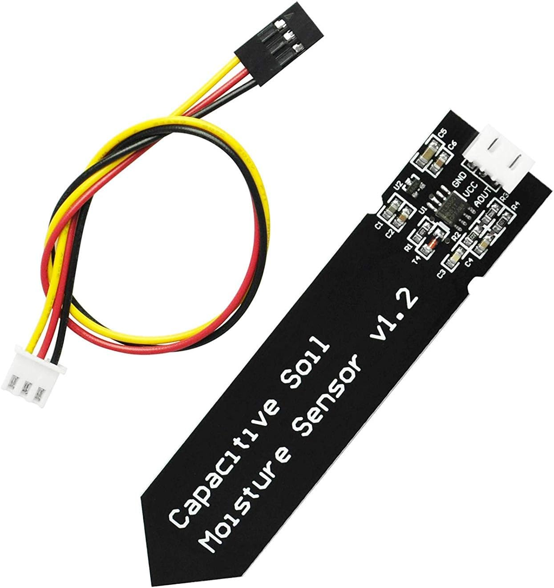
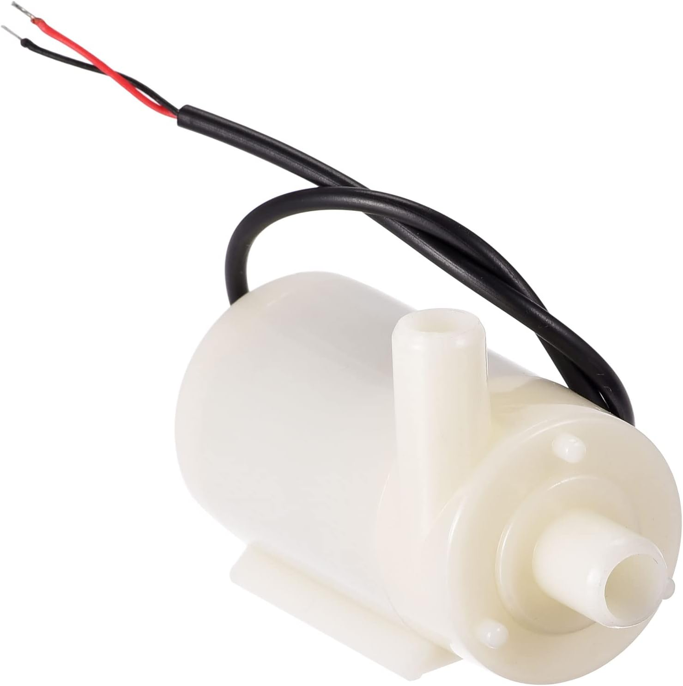

# 🌱 L'ARROSOIR AUTOMATIQUE
 

 
L' <strong>arrosoir automatique</strong> est un arrosoir qui décide par lui même d'arroser la plante quand il estime que cette dernière n'a plus assez d'eau.

<h4 style="padding-left: 50px;">
😍   Waouh, mais c'est génial ‼️
</h4>

 
 😉  Eh oui, comme tu dis, c'est <strong>GE-NIAL</strong>

<h4 style="padding-left: 50px;">
🤔 Mais attend, comment un arrosoir pourrait arroser tout seul ? Et surtout comment un arrosoir pourrait savoir quand il faut arroser ?
</h4>

 
C'est ce que nous allons essayer de comprendre et surtout de réaliser 🥸.

D'abord, pour qu'un arrosoir puisse devenir autonome, il faut le doter de quelques composants :
  

<ul>

<li class="component"> <strong style="text-transform: uppercase; font-size: .75em"> un capteur d'humidité du sol</strong>   

 

        Les capteurs d'humidité du sol mesurent la teneur en eau volumétrique du sol

Voilà le premier allié de notre arrosoir. 

C'est lui qui sera chargé de dire la quantité d'eau qu'on a dans la terre 🪴.

</li> 

<li class="component"> <strong style="text-transform: uppercase; ; font-size: .75em">une mini pompe à moteur submersible</strong>   

  
        
        Une pompe submersible (ou pompe électrique submersible (ESP)) est un dispositif qui possède un moteur 

        hermétiquement scellé étroitement couplé au corps de la pompe.

Lui 👆, c'est l'élément central de notre arrosoir.

Il peut, grâce à son moteur 📽️, pomper de l'eau 🌊 qui servira à arroser la plante 🌱.

</li> 

<li class="component"> <strong style="text-transform: uppercase; ; font-size: .75em">un micro-contrôleur </strong>  

  

        Un microcontrôleur est un circuit intégré qui rassemble les éléments essentiels d'un ordinateur.

En fait, un microcontrôleur c'est comme un tout petit ordinateur 🖥️.

Celui là s'appelle    Raspberry Pi Pico

Il sera le 🧠 cerveau de notre arrosoir.

🤔...

Okay 🙄 bon, il faudra quand même lui dire exactement ce qu'on attend de lui...

🤔...

 Il faudra le lui dire dans un langage qu'il comprend 🤗 ... <strong>le python 🐍</strong> 

😱...

🤣 Non, python, c'est un langage informatique ☺️

</li> 

</ul>

Eh oui !!! Nous allons écrire un <strong>programme informatique</strong> en <strong> language python 🐍</strong> pour piloter notre arrosoir. 

C'est ce qu'on appelle un <strong>système embarqué</strong>

Allez au travail 😜 et seulement après, tu pourras regarder le code final 👇.

