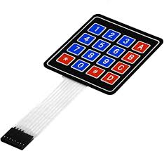
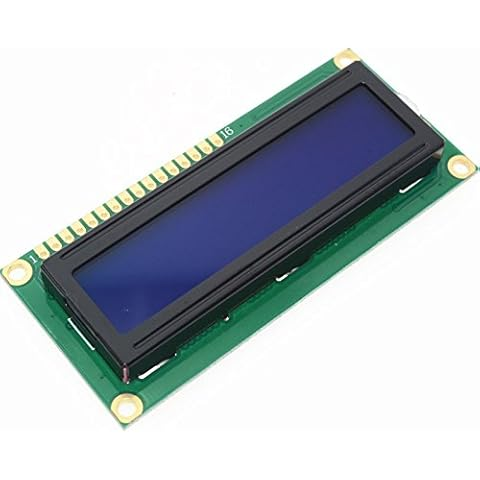
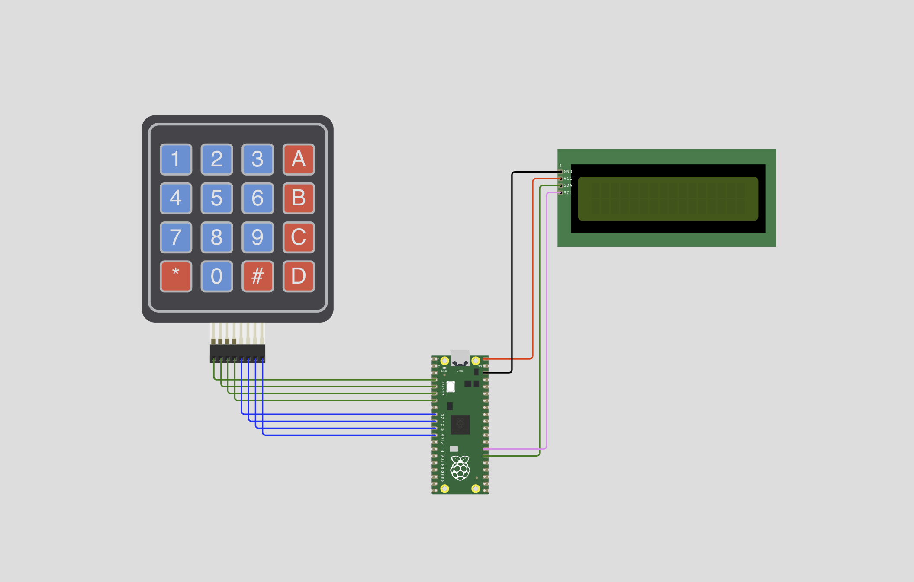

# 🧮 LA CALCULATRICE

 
Ce projet de <strong>calculatrice</strong> vise à créer une calculatrice qui permettra de réaliser des opérations mathématiques de base.

<h4 style="padding-left: 50px;">
🤨   Une vraie calculatrice ❓ ❓
</h4>

 
 😉  Eh oui, une vraie de vrai

<h4 style="padding-left: 50px;">
🤔 Et comment on fait ça ?
</h4>

 
Je vais t'expliquer !!

 
    D'abord, on a besoin de quelques composants pour créer notre calculatrice :

  

<ul>

<li class="component"> <strong style="text-transform: uppercase; font-size: .75em"> Un clavier matriciel</strong>   

 

        Le clavier matriciel est un type de clavier dont la disposition s'apparente à une matrice et qui est utilisé comme périphérique pour les microcontrôleurs

C'est le clavier de notre calculatrice. 

Il permettra à l'utilisateur de saisir les nombres et les opérations à effectuer.

</li> 

<li class="component"> <strong style="text-transform: uppercase; ; font-size: .75em">Un écran lcd i2c</strong>  

  

Et là c'est l'écran qui affichera la saisie de l'utilisateur et le résultat des opérations effectuées.

</li> 

<li class="component"> <strong style="text-transform: uppercase; ; font-size: .75em">micro-contrôleur </strong>  

  

        Un microcontrôleur est un circuit intégré qui rassemble les éléments essentiels d'un ordinateur.

En fait, un microcontrôleur, c'est comme un tout petit ordinateur 🖥️.

Celui là s'appelle    Raspberry Pi Pico

Il sera le 🧠 cerveau de notre poubelle.

🤔...

Okay 🙄 bon, il faudra quand même lui dire exactement ce qu'on attend de lui...

🤔...

 Il faudra le lui dire dans un langage qu'il comprend 🤗 ... <strong>le python 🐍</strong> 

😱...

🤣 Non, python, c'est un langage informatique ☺️

</li> 

</ul>

Eh oui !!! Nous allons écrire un <strong>programme informatique</strong> en <strong> language python 🐍</strong> pour piloter notre calculatrice. 

C'est ce qu'on appelle un <strong>système embarqué</strong>

<h3 style="padding-left: 50px; padding-top: 20px; padding-bottom: 10px;">
SCHEMA DE NOTRE CIRCUIT
</h3>

Voilà un peu à quoi devra ressembler notre circuit.

Nous aurons besoin de quelques cables 🧶pour relier nos composants entre eux.

⚠️ Prenez soin de choisir des cables de la bonne couleur pour ne pas vous perdre dans vos branchements️ 😜

Allez au travail 😜!!! 

 

Je vous mets le code final 👇 ici. Vous pourrez le consulter après les explications.

