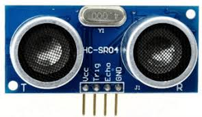
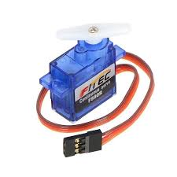
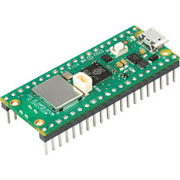
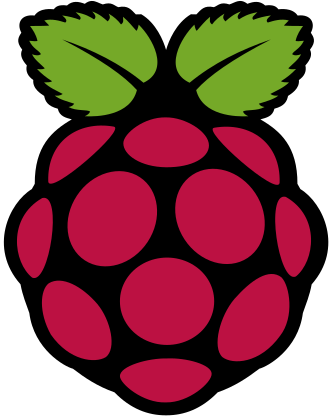
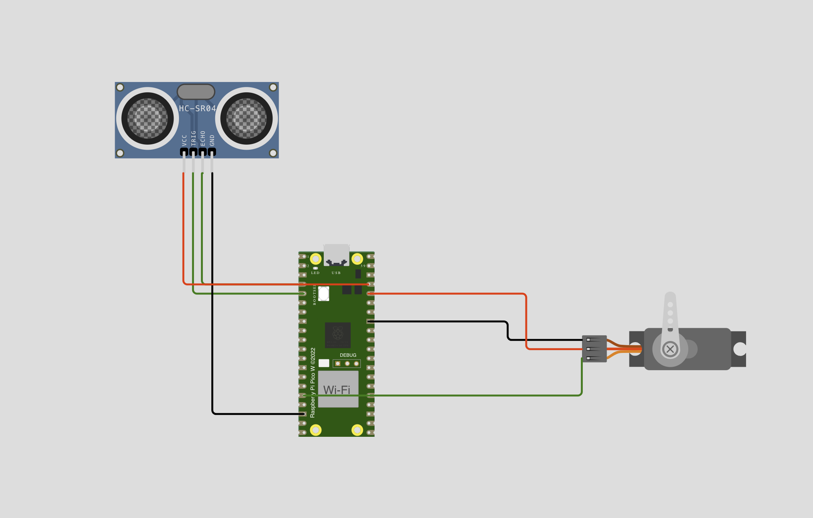

# 🗑️ LA POUBELLE INTELLIGENTE

   

 
La <strong>poubelle intelligente</strong> est une poubelle qui peut détecter une présence et s'ouvrir automatiquement lorsque quelqu'un se trouve à proximité.

<h4 style="padding-left: 50px;">
 😳   Mais comment est-ce possible ❓ ❓
</h4>

 
 😉  La <strong> TECH-NO-LO-GIE </strong>

<h4 style="padding-left: 50px;">
🤖 Comment cela fonctionne-t-il ?
</h4>

 
Pour pouvoir fonctionner, la <strong>poubelle intelligente</strong> sera munie d'un :
  

<ul>

<li class="component"> <strong style="text-transform: uppercase; font-size: .75em">capteur à ultrasons </strong>   

 

        Le capteur à ultrasons permet de détecter les objets grâce à des ondes ultrasoniques.

Ce capteur sera les  👀 yeux de notre poubelle. 

C'est lui qui nous dira Attention ⚠️ il y a quelqu'un  qui veut jeter quelque chose à la poubelle 

</li> 

<li class="component"> <strong style="text-transform: uppercase; ; font-size: .75em">servo-moteur </strong>  

  
        
        Un servomoteur est un système motorisé capable d'atteindre des positions prédéterminées, puis de les maintenir.

Et là 👆, c'est le moteur qui va ouvrir la poubelle.

Il possède un bras articulé 🦾 qui permettra de soulever le couvercle de la poubelle.

</li> 

<li class="component"> <strong style="text-transform: uppercase; ; font-size: .75em">micro-contrôleur </strong>  

  

        Un microcontrôleur est un circuit intégré qui rassemble les éléments essentiels d'un ordinateur.

En fait, un microcontrôleur, c'est comme un tout petit ordinateur 🖥️.

Celui là s'appelle    Raspberry Pi Pico

Il sera le 🧠 cerveau de notre poubelle.

🤔...

Okay 🙄 bon, il faudra quand même lui dire exactement ce qu'on attend de lui...

🤔...

 Il faudra le lui dire dans un langage qu'il comprend 🤗 ... <strong>le python 🐍</strong> 

😱...

🤣 Non, python c'est un langage informatique ☺️

</li> 

</ul>

Eh oui !!! Nous allons écrire un <strong>programme informatique</strong> en <strong> language python 🐍</strong> pour piloter notre poubelle. 

C'est ce qu'on appelle un <strong>système embarqué</strong>

<h3 style="padding-left: 50px; padding-top: 20px; padding-bottom: 10px;">
SCHEMA DE NOTRE CIRCUIT
</h3>

Voilà un peu à quoi devra ressembler notre circuit.

Nous aurons besoin de quelques cables 🧶pour relier nos composants entre eux.

⚠️ Prenez soin de choisir des cables de la bonne couleur pour ne pas vous perdre dans vos branchements️ 😜

Allez au travail 😜!!! 

 

Je vous mets le code final 👇 ici. Vous pourrez le consulter après les explications.

